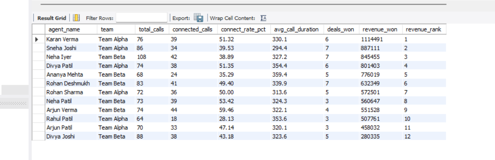
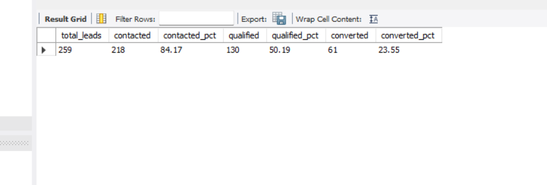

# CallPal CRM Analytics (SQL Project)

A SQL analytics project modeled on **Callpal**, a CRM platform for SMEs, built off my
Data Analyst internship at Brawizz Tech (May–June 2026). During the internship I used
SQL and Python to clean and analyze customer/call data, and built a Call Analytics &
Team Performance Dashboard in Power BI that cut reporting time by 30%.

This repo recreates that analytics pipeline end-to-end using a dataset - from raw lead/call/opportunity records to the SQL logic that would feed a BI dashboard.

## Problem Statement

A CRM captures leads, logs every outbound/inbound call, and tracks deals through
a sales pipeline. Sales managers need answers to:
- Which lead sources actually convert, not just generate volume?
- Which agents/teams are over- or under-performing, and by how much?
- Where in the funnel are leads dropping off?
- What does the team's performance dashboard look like, refreshed on demand?

This project answers all four using pure SQL.

## Schema

```
agents (agent_id PK, agent_name, team, join_date)
leads  (lead_id PK, lead_name, source, status, created_date, agent_id FK -> agents)
calls  (call_id PK, lead_id FK -> leads, agent_id FK -> agents,
        call_date, call_type, outcome, duration_seconds)
opportunities (opp_id PK, lead_id FK -> leads, stage, deal_value,
               created_date, closed_date)
```

**Relationships:** one agent → many leads → many calls; qualifying leads → one opportunity.

## Files

| File | Purpose |
|---|---|
| `schema.sql` | Table definitions with primary/foreign keys |
| `seed_data.sql` | Synthetic dataset: 12 agents, 300 leads, 936 calls, 130 opportunities |
| `queries.sql` | 15 queries, progressing from basic aggregation to CTEs |

## How to run

**MySQL:**
```bash
mysql -u root -p your_database < schema.sql
mysql -u root -p your_database < seed_data.sql
mysql -u root -p your_database < queries.sql
```

**PostgreSQL** (minor tweak): replace `DATE_FORMAT(x, '%Y-%m')` with
`TO_CHAR(x, 'YYYY-MM')` and `DATE_SUB(x, INTERVAL 14 DAY)` with `x - INTERVAL '14 days'`
in `queries.sql` (only used in queries 3.3 and 4.3).

## Query set

1. **Basic aggregation** - calls by outcome, leads by source, average call duration
2. **Joins** - conversion rate by lead source, calls handled per agent, pipeline value per agent, closed-won revenue by team
3. **Window functions** - agent ranking within team, connect rate vs. team average, month-over-month lead growth, running revenue total
4. **CTEs** - funnel drop-off analysis, **Team Performance Dashboard** (signature query), cold/stale lead detection

## Sample insights (from the seeded dataset)

- Out of 300 leads, **218 (72.7%) were contacted**, **130 (43.3%) qualified**, and **61 (20.3%) converted** - the biggest drop-off is between "Qualified" and "Converted."
- **Email Campaign** leads converted at **25.5%**, the highest of all five sources, ahead of Cold Call (23.2%) and Website (19.5%) - despite generating the fewest raw leads.
- Total closed-won revenue across all agents: **₹79,87,632** from 61 deals.
- Top individual performer by revenue: **Karan Verma (Team Alpha)** at ₹11,14,491 - used the team-performance query to identify this.

## Why this project

This isn't a generic "employees and departments" SQL exercise - it mirrors a real
CRM analytics workflow I built during my internship: lead tracking, call logging,
sales pipeline monitoring, and a performance dashboard, the same components behind
Callpal's actual product.


## Sample Output **Team Performance Dashboard:**  **Lead Funnel:** 
